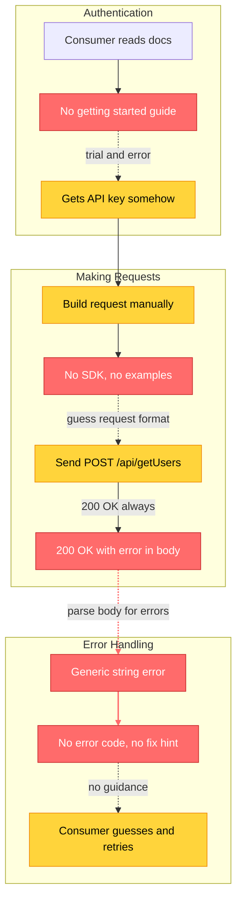
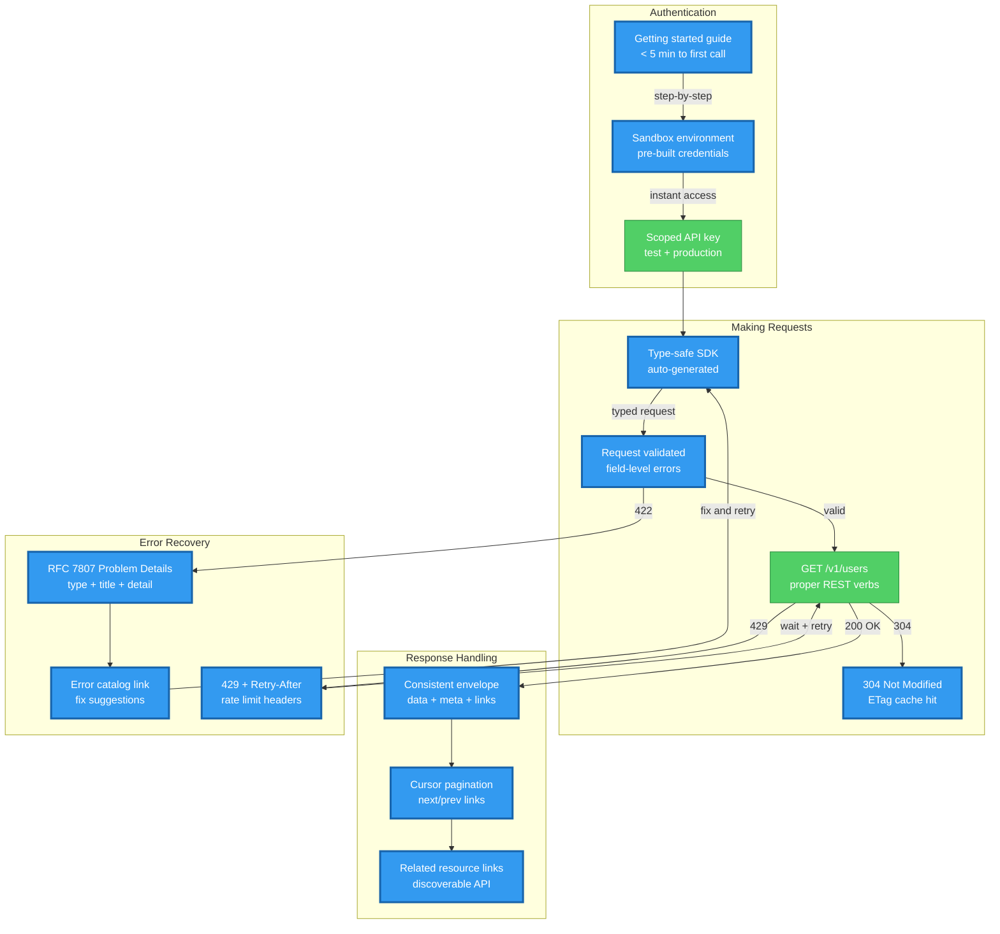

# Output Templates — Improvement Plan & API Flow Diagrams

> Mandatory output formats for api-rx scorecards. Every evaluation MUST include:
> 1. The scorecard (defined in SKILL.md)
> 2. Per-dimension improvement plan (this file, Section 1)
> 3. Before/After Mermaid API request/response flow diagrams (this file, Section 2)

---

## Section 1: Per-Dimension Improvement Plan

After the API Opportunity Map and before the API Flow diagrams, include a detailed improvement plan
for EVERY dimension scoring below 97 (A+).

### Format

```markdown
## Improvement Plan: D[N] [Dimension Name] — [Current Score] -> 97+ (A+)

### Current State ([Grade])
[1-2 sentence summary of what consumers currently experience, citing evidence from discovery]

### Gap Analysis
| Sub-Metric | Current | Target | Gap | Key Blocker |
|------------|---------|--------|-----|-------------|
| M[N].1 [name] | [score] | 97+ | [delta] | [specific endpoint/handler/middleware blocking improvement] |
| M[N].2 [name] | [score] | 97+ | [delta] | [specific blocker] |
| M[N].3 [name] | [score] | 97+ | [delta] | [specific blocker] |
| M[N].4 [name] | [score] | 97+ | [delta] | [specific blocker] |

### Improvement Steps (ordered by impact)

#### Step 1: [Action] -> M[N].X +[N] points
- **What**: [Concrete API improvement — e.g., "Add structured error responses with RFC 7807 Problem Details"]
- **Where**: [File paths to modify — e.g., `src/middleware/error-handler.ts`, `src/utils/api-error.ts`]
- **Standard**: [Reference — e.g., "RFC 7807 Problem Details", "Google AIP-193 Errors", "Stripe Error Format"]
- **Implementation**: [Brief technical approach — e.g., "Create ApiError class wrapping {type, title, status, detail, instance, errors[]}"]
- **Acceptance Criteria**:
  - [ ] [Measurable outcome 1 — e.g., "All error responses include type, title, status, and detail fields"]
  - [ ] [Measurable outcome 2 — e.g., "Validation errors include field-level details in errors[] array"]
  - [ ] [Measurable outcome 3 — e.g., "Error type URIs resolve to documentation pages"]
- **Effort**: [S/M/L]

#### Step 2: [Action] -> M[N].Y +[N] points
[... same format ...]

### Target State ([A+])
[1-2 sentence description of what the API consumer experience looks like after all steps complete]
```

### Rules for Improvement Plans

1. **Every dimension below 97 gets a plan.** No exceptions.
2. **Steps are ordered by point impact.** Highest delta first within each dimension.
3. **Acceptance criteria are measurable API outcomes.** "Improve error handling" is not acceptable. "All 4xx errors return RFC 7807 Problem Details with type URI, title, status, detail, and errors[] for validation failures" is.
4. **File paths are mandatory.** Every step must reference the specific files affected.
5. **Standard reference is mandatory.** Every step cites the specific RFC, specification, or industry standard.
6. **Implementation hint is mandatory.** Brief technical approach so the developer knows where to start.
7. **Effort sizing is mandatory.** S = < 1 day, M = 1-3 days, L = 3+ days.

---

## Section 2: Before/After Mermaid API Flow Diagrams

Every scorecard MUST include two Mermaid diagrams showing the **API request/response flow transformation**.
These diagrams show CONSUMER EXPERIENCE (requests, responses, errors, retries), NOT server internals.
Place these after the Improvement Plans and before the Roadmap to A+.

### Before Diagram — Current API Consumer Flow

Shows the API consumer journey AS-IS with pain points highlighted.

Use these conventions:
- **Red nodes** (`:::danger`) for bad DX (broken, confusing, undocumented)
- **Orange nodes** (`:::warning`) for mediocre DX (works but frustrating)
- **Green nodes** (`:::success`) for good DX (clear, fast, well-documented)
- **Blue nodes** (`:::info`) for system responses / automated steps
- **Dashed lines** (`-.->`) for missing information or dead-end errors
- **Bold labels** on edges for response times, status codes, or confusion points
- Subgraphs for logical API interaction phases
- Use `flowchart TB` or `flowchart LR` depending on flow complexity

Template:

````markdown
### API Flow: Before (Current State — [SCORE] [GRADE])


````

### After Diagram — Target A+ API Consumer Flow

Shows the API consumer journey AFTER implementing all improvement plan steps.

Use these conventions:
- **Green nodes** (`:::success`) for improved existing steps
- **Blue nodes** (`:::new`) for new DX components/patterns added
- **Solid lines** for all connections — no dead ends
- **Edge labels** showing status codes, response times, and headers
- Subgraphs match the improved journey phases

Template:

````markdown
### API Flow: After (Target — 97+ A+)


````

### Flow Diagram Examples by API Pattern

#### CRUD Resource Flow

Before (bad DX):
```
POST /api/createUser -> 200 {success: true} -> GET /api/getUserById?id=123 -> 200 {error: "not found"}
```

After (A+ DX):
```
POST /v1/users -> 201 {data: {id, ...}, links: {self}} -> GET /v1/users/123 -> 200 {data, links} | 404 Problem Details
```

#### Pagination Flow

Before (bad DX):
```
GET /api/items -> 200 [{...}, {...}, ...all 10,000 items...] -> client-side pagination
```

After (A+ DX):
```
GET /v1/items?cursor=abc&limit=25 -> 200 {data: [...], meta: {total}, links: {next, prev}}
```

#### Webhook Integration Flow

Before (bad DX):
```
Event fires -> POST to consumer -> no signature -> consumer can't verify -> no retry on failure
```

After (A+ DX):
```
Event fires -> POST with HMAC signature + timestamp -> consumer verifies -> 200 ACK | failure -> exponential backoff retry -> dead letter after N attempts -> manual replay API
```

#### Error Recovery Flow

Before (bad DX):
```
Request -> 200 {error: "Something went wrong"} -> consumer parses body -> no error code -> guess what failed
```

After (A+ DX):
```
Request -> 422 {type, title, status, detail, errors: [{field, message}]} -> consumer reads error catalog -> fixes and retries
```

### Diagram Construction Rules

1. **Both diagrams are mandatory.** Never output a scorecard without Before/After API flow diagrams.
2. **Before diagram must show real consumer journeys.** Derive from discovery output and actual endpoints, not hypothetical flows.
3. **After diagram must match the improvement plan.** Every new node in the diagram must correspond to an improvement step. No phantom features.
4. **Use consistent node IDs.** Same API action keeps the same ID in both diagrams for visual comparison.
5. **Show consumer perspective, not server internals.** Nodes represent what the consumer sends/receives, not database queries or internal services.
6. **Annotate status codes on edges.** Show HTTP status codes, header values, and response times (e.g., "200 OK", "429 + Retry-After: 30", "304 Not Modified").
7. **Color-code by DX quality.** Before diagram uses danger/warning/success/dead. After diagram should be all success/new.
8. **Subgraph boundaries = integration phases.** Group by consumer journey stage (Authentication, Request Building, Response Handling, Error Recovery, Webhook Integration).
9. **Maximum 20 nodes per diagram.** If the flow is larger, focus on the most impactful transformation area and note what is omitted.
10. **Show error paths explicitly.** Every flow must include the error/edge case path, not just the happy path.
11. **Include dead ends in Before.** Use dashed lines (`-.->`) and `:::dead` class for places where consumers get stuck.
12. **Eliminate all dead ends in After.** Every path must lead to a clear resolution or recovery.

---

## Section 3: Complete Output Structure

The final scorecard output MUST follow this order:

```
1. Header (target, overall score/grade, API type)
2. Dimension Summary Table (8 rows with weights, scores, grades, weakest sub-metric)
3. Sub-Metric Detail (all 32 sub-metrics across 8 dimensions)
4. API Opportunity Map (ordered by weighted score impact)
5. Per-Dimension Improvement Plans (all dimensions < 97)
6. API Flow: Before (Mermaid diagram — current consumer journey with pain points)
7. API Flow: After (Mermaid diagram — target consumer journey with new patterns)
8. Roadmap to A+ (phased plan with effort estimates)
```

### Detailed Section Requirements

#### 1. Header

```markdown
# API Design Grade: [TARGET]

**Type:** REST API / GraphQL / gRPC / Mixed
**Overall:** [SCORE] ([GRADE])
**Evaluated:** [date]
**Endpoints analyzed:** [count]
```

#### 2. Dimension Summary Table

```markdown
| # | Dimension | Weight | Score | Grade | Weakest Sub-Metric |
|----|-----------|--------|-------|-------|---------------------|
| D1 | REST Maturity & Resource Design | 15% | [X] | [G] | [metric: raw value] |
| D2 | Response Consistency & Contracts | 15% | [X] | [G] | [metric: raw value] |
| ... | ... | ... | ... | ... | ... |
```

#### 3. Sub-Metric Detail

Every sub-metric must include:
- Current score and threshold row matched
- Evidence (file path, endpoint, or middleware name)
- One-line finding

#### 4. API Opportunity Map

Ordered by `weight * point_delta` descending. Each entry:

```markdown
### API-001: [Title]
- **Standard**: [RFC / spec / industry reference]
- **Current**: [what consumers experience now]
- **Proposed**: [specific API improvement]
- **Implementation**: [brief technical approach]
- **Impact**: D[N] +[X] pts (weighted: +[Y])
- **Effort**: [S/M/L]
- **Affected endpoints**: [list]
```

#### 5. Per-Dimension Improvement Plans

See Section 1 of this file for format.

#### 6. API Flow: Before (Mermaid)

See Section 2 of this file for format. Must reflect real discovered consumer journeys.

#### 7. API Flow: After (Mermaid)

See Section 2 of this file for format. Must correspond to improvement plan steps.

#### 8. Roadmap to A+

```markdown
## Roadmap to A+

### Phase 1: Quick Wins (1-2 days) — Score [X] -> [Y]
- [ ] [Action] — D[N] +[X] pts — Effort: S
- [ ] [Action] — D[N] +[X] pts — Effort: S

### Phase 2: Core Improvements (3-5 days) — Score [Y] -> [Z]
- [ ] [Action] — D[N] +[X] pts — Effort: M
- [ ] [Action] — D[N] +[X] pts — Effort: M

### Phase 3: Polish & Advanced DX (5-10 days) — Score [Z] -> 97+ (A+)
- [ ] [Action] — D[N] +[X] pts — Effort: L
- [ ] [Action] — D[N] +[X] pts — Effort: M
```

### Output Validation Checklist

Before finalizing a scorecard, verify:

- [ ] All 8 dimensions have scores and grades
- [ ] All 32 sub-metrics have evidence and threshold matches
- [ ] Every dimension below 97 has a complete improvement plan
- [ ] Every improvement step has: What, Where, Standard, Implementation, Acceptance Criteria, Effort
- [ ] Before Mermaid diagram reflects real discovered consumer flows
- [ ] After Mermaid diagram has a node for every improvement plan step
- [ ] No dead ends exist in the After diagram
- [ ] API Opportunity Map is ordered by weighted impact
- [ ] Roadmap phases have cumulative score projections
- [ ] All file paths are absolute
- [ ] All standard references are specific (not just "REST" but "Richardson Level 2 — HTTP Verbs")
