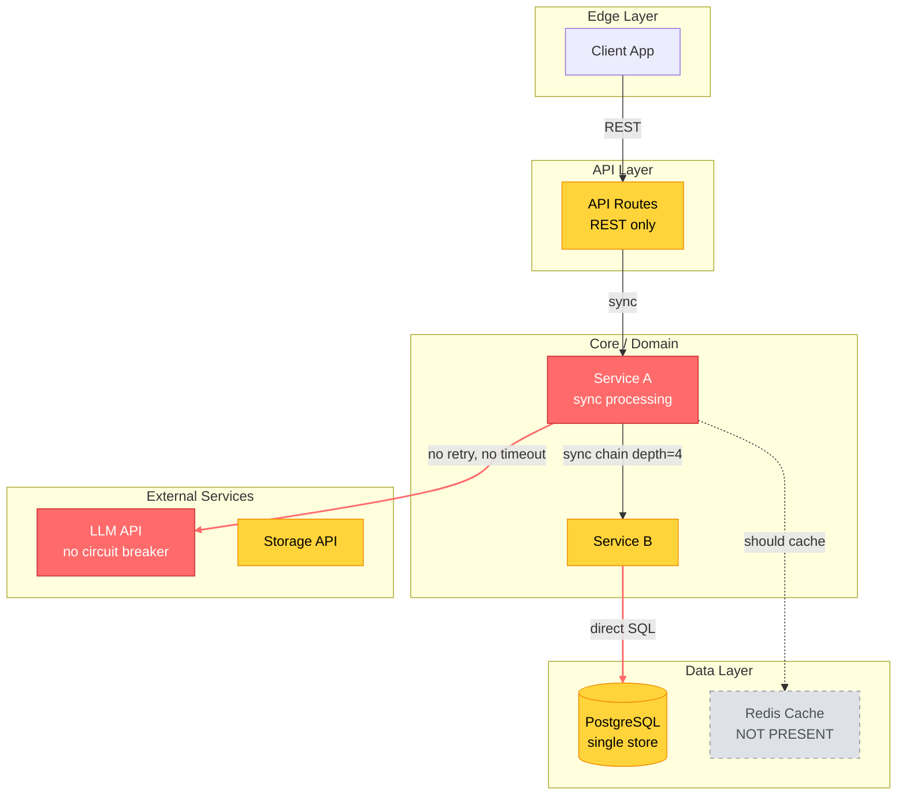
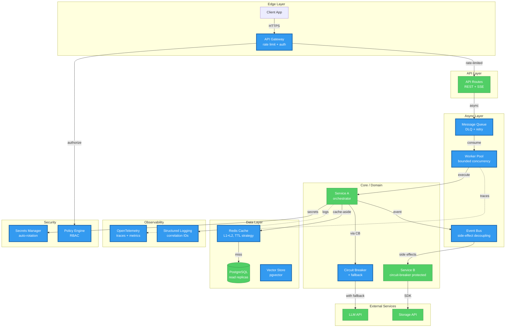

# Output Templates — Improvement Plan & Mermaid Diagrams

> Mandatory output formats for arch-rx scorecards. Every evaluation MUST include:
> 1. The scorecard (defined in SKILL.md)
> 2. Per-dimension improvement plan (this file, Section 1)
> 3. Before/After Mermaid architecture diagrams (this file, Section 2)

---

## Section 1: Per-Dimension Improvement Plan

After the ADR Opportunity Map and before the Roadmap to A+, include a detailed improvement plan
for EVERY dimension scoring below 97 (A+).

### Format

```markdown
## Improvement Plan: D[N] [Dimension Name] — [Current Score] → 97+ (A+)

### Current State ([Grade])
[1-2 sentence summary of what exists today, citing evidence from discovery]

### Gap Analysis
| Sub-Metric | Current | Target | Gap | Key Blocker |
|------------|---------|--------|-----|-------------|
| M[N].1 [name] | [score] | 97+ | [delta] | [specific file/flow/pattern blocking improvement] |
| M[N].2 [name] | [score] | 97+ | [delta] | [specific blocker] |
| M[N].3 [name] | [score] | 97+ | [delta] | [specific blocker] |
| M[N].4 [name] | [score] | 97+ | [delta] | [specific blocker] |

### Improvement Steps (ordered by impact)

#### Step 1: [Action] → M[N].X +[N] points
- **What**: [Concrete action — e.g., "Add BullMQ with DLQ for eval processing"]
- **Where**: [File paths or modules to modify]
- **Pattern**: [Framework pattern name and source]
- **Stack Implementation**: [Concrete library from stack-adapters.md]
- **Acceptance Criteria**:
  - [ ] [Measurable criterion 1]
  - [ ] [Measurable criterion 2]
  - [ ] [Measurable criterion 3]
- **Effort**: [S/M/L]

#### Step 2: [Action] → M[N].Y +[N] points
[... same format ...]

### Target State ([A+])
[1-2 sentence description of what the architecture looks like after all steps complete]
```

### Rules for Improvement Plans

1. **Every dimension below 97 gets a plan.** No exceptions.
2. **Steps are ordered by point impact.** Highest delta first within each dimension.
3. **Acceptance criteria are measurable.** "Add caching" is not acceptable. "Redis cache-aside for /api/evals with TTL=300s, invalidated on write" is.
4. **File paths are mandatory.** Every step must reference the specific files/modules affected.
5. **Stack implementation is mandatory.** Use concrete libraries from stack-adapters.md.
6. **Effort sizing is mandatory.** S = < 1 day, M = 1-3 days, L = 3+ days.

---

## Section 2: Before/After Mermaid Architecture Diagrams

Every scorecard MUST include two Mermaid diagrams showing the architectural transformation.
Place these after the Improvement Plans and before the Roadmap to A+.

### Before Diagram — Current Architecture

Shows the system AS-IS with annotations highlighting problem areas.

Use these conventions:
- **Red nodes** (`:::danger`) for components scoring F-D
- **Orange nodes** (`:::warning`) for components scoring C-B
- **Green nodes** (`:::success`) for components scoring A-A+
- **Dashed lines** (`-.->`) for missing connections that should exist
- **Bold labels** on edges for protocol mismatches
- Subgraphs for logical layers/boundaries

Template:

````markdown
### Architecture: Before (Current State — [SCORE] [GRADE])


````

### After Diagram — Target A+ Architecture

Shows the system AFTER implementing all improvement plan steps.

Use these conventions:
- **All green nodes** (`:::success`) — target is A+ everywhere
- **Solid lines** for all connections — no missing pieces
- **Edge labels** showing correct protocols
- **New components** highlighted with thicker borders
- Subgraphs match the improved boundary structure

Template:

````markdown
### Architecture: After (Target — 97+ A+)


````

### Diagram Construction Rules

1. **Both diagrams are mandatory.** Never output a scorecard without Before/After diagrams.
2. **Before diagram must show real architecture.** Derive from discovery output, not hypothetical.
3. **After diagram must match the improvement plan.** Every new component in the diagram must correspond to an improvement step. No phantom components.
4. **Use consistent node IDs.** Same component keeps the same ID in both diagrams for visual comparison.
5. **Annotate protocols on edges.** Show REST, gRPC, SSE, queue, event on every connection.
6. **Show data flow direction.** Arrows indicate request/data flow, not dependency direction.
7. **Color-code by score.** Before diagram uses danger/warning/success/missing. After diagram should be all success/new.
8. **Subgraph boundaries = architectural boundaries.** Group by layer (Edge, API, Async, Core, Data, External, Observability, Security).
9. **Maximum 20 nodes per diagram.** If the architecture is larger, focus on the most impactful transformation area and note what's omitted.
10. **Include a legend** if using more than 3 color classes.

### Diagram Variations by Architecture Style

#### Microservices — Use `graph LR` (left-to-right)

```
graph LR
    subgraph ServiceA["Service A"]
        ...
    end
    subgraph ServiceB["Service B"]
        ...
    end
    ServiceA -->|gRPC| ServiceB
```

#### Event-Driven — Use `graph TB` with event bus as central

```
graph TB
    subgraph Producers
        ...
    end
    BUS[Event Bus / Message Broker]
    subgraph Consumers
        ...
    end
    Producers -->|publish| BUS
    BUS -->|subscribe| Consumers
```

#### Monolith Modular — Use `graph TB` with layer subgraphs

```
graph TB
    subgraph Presentation
        ...
    end
    subgraph Application
        ...
    end
    subgraph Domain
        ...
    end
    subgraph Infrastructure
        ...
    end
```

#### Data Pipeline / ETL — Use `graph LR` with stages

```
graph LR
    SOURCE -->|ingest| TRANSFORM -->|load| SINK
```

---

## Section 3: Complete Output Structure

The final scorecard output MUST follow this order:

```
1. Header (layer name, stack, overall score/grade)
2. Dimension Summary Table
3. Sub-Metric Detail (all 11 dimensions)
4. ADR Opportunity Map (ordered by score impact)
5. Per-Dimension Improvement Plans (all dimensions < 97)     ← NEW
6. Architecture: Before (Mermaid diagram)                     ← NEW
7. Architecture: After (Mermaid diagram)                      ← NEW
8. Roadmap to A+ (phased plan)
```
