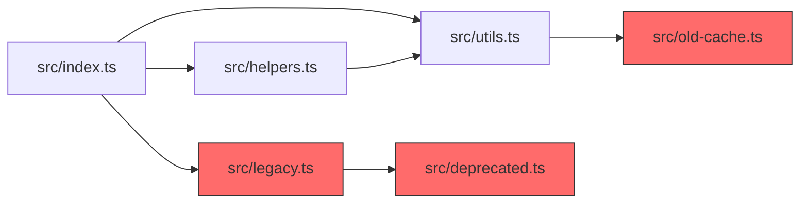
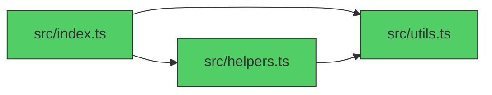

# clean-rx Output Templates

## Report Header

```markdown
# clean-rx Codebase Cleanup Report

**Project:** {{PROJECT_NAME}}
**Scan Date:** {{SCAN_DATE}}
**Scan Path:** {{SCAN_PATH}}
**Overall Score:** {{OVERALL_SCORE}} ({{OVERALL_GRADE}})
**Stacks Detected:** {{STACKS}} (Python / Next.js / Supabase)

---
```

## Executive Summary

```markdown
## Executive Summary

| Rating | Score | Waste Items | Auto-Deletable |
|--------|-------|-------------|----------------|
| {{OVERALL_GRADE}} | {{OVERALL_SCORE}}/100 | {{TOTAL_ITEMS}} | {{TIER1_COUNT}} |

**Top Waste Areas:**
1. {{WASTE_1}} — {{COUNT_1}} items, ~{{SIZE_1}} saved
2. {{WASTE_2}} — {{COUNT_2}} items
3. {{WASTE_3}} — {{COUNT_3}} items

**Cleanest Areas:**
1. {{CLEAN_1}} — score {{SCORE_1}}
2. {{CLEAN_2}} — score {{SCORE_2}}
```

## Dimension Scorecard

```markdown
## Dimension Scores

| # | Dimension | Weight | Score | Grade | Findings | Worst Sub-Metric |
|---|-----------|--------|-------|-------|----------|------------------|
| D1 | Dead Code & Unreachable | 15% | {{D1_SCORE}} | {{D1_GRADE}} | {{D1_FINDINGS}} | {{D1_WORST}} |
| D2 | Unused Dependencies | 12% | {{D2_SCORE}} | {{D2_GRADE}} | {{D2_FINDINGS}} | {{D2_WORST}} |
| D3 | Orphan Files & Assets | 10% | {{D3_SCORE}} | {{D3_GRADE}} | {{D3_FINDINGS}} | {{D3_WORST}} |
| D4 | Stale Configuration | 10% | {{D4_SCORE}} | {{D4_GRADE}} | {{D4_FINDINGS}} | {{D4_WORST}} |
| D5 | Type & Lint Debt | 10% | {{D5_SCORE}} | {{D5_GRADE}} | {{D5_FINDINGS}} | {{D5_WORST}} |
| D6 | Import Hygiene | 10% | {{D6_SCORE}} | {{D6_GRADE}} | {{D6_FINDINGS}} | {{D6_WORST}} |
| D7 | Supabase Waste | 8% | {{D7_SCORE}} | {{D7_GRADE}} | {{D7_FINDINGS}} | {{D7_WORST}} |
| D8 | Next.js Waste | 8% | {{D8_SCORE}} | {{D8_GRADE}} | {{D8_FINDINGS}} | {{D8_WORST}} |
| D9 | Python Waste | 8% | {{D9_SCORE}} | {{D9_GRADE}} | {{D9_FINDINGS}} | {{D9_WORST}} |
| D10 | Git Hygiene | 9% | {{D10_SCORE}} | {{D10_GRADE}} | {{D10_FINDINGS}} | {{D10_WORST}} |
```

## Sub-Metric Detail (per dimension)

```markdown
### D1: Dead Code & Unreachable ({{D1_SCORE}})

| Sub-Metric | Weight | Raw Value | Score | Threshold Row |
|------------|--------|-----------|-------|---------------|
| M1.1 Unused Exports | 25% | {{RAW}} unused exports | {{SCORE}} | {{ROW}} |
| M1.2 Dead Functions | 25% | {{RAW}} dead functions | {{SCORE}} | {{ROW}} |
| M1.3 Unreachable Code | 25% | {{RAW}} unreachable blocks | {{SCORE}} | {{ROW}} |
| M1.4 Commented-Out Code | 25% | {{RAW}} code blocks | {{SCORE}} | {{ROW}} |

D1 = ({{M1.1}} * 0.25) + ({{M1.2}} * 0.25) + ({{M1.3}} * 0.25) + ({{M1.4}} * 0.25) = {{D1_SCORE}}

[... repeat for D2-D10 with same table format ...]
```

## Safe Deletion List

This is the KEY output of clean-rx. Every item must include verification source.

```markdown
## Safe Deletion List

### Tier 1: Zero-Risk Deletions (auto-deletable)

Verified by 2+ independent sources. Safe to delete without review.

| # | Type | File/Item | Reason | Verified By | Est. Savings |
|---|------|-----------|--------|-------------|--------------|
| 1 | Unused import | src/lib/utils.ts:3 | `import { foo }` — foo never used | LSP + knip | — |
| 2 | Orphan file | src/old-helper.ts | Not imported anywhere | madge + grep | 120 LOC |
| 3 | Unused dep | `moment` in package.json | Not imported in any source file | depcheck + grep | 290KB |
| 4 | Commented code | src/api/handler.ts:45-67 | 22 lines of commented-out function | pattern match + manual | 22 LOC |
| 5 | Empty __init__.py | src/utils/__init__.py | Empty file, Python 3.3+ namespace pkg | filesystem | — |

**Tier 1 Total: {{COUNT}} items — {{LOC_SAVED}} LOC, {{SIZE_SAVED}} dependencies**

### Tier 2: Likely Safe (review before deleting)

Verified by 1 source. Minor risk of dynamic usage.

| # | Type | File/Item | Reason | Risk | Verification |
|---|------|-----------|--------|------|--------------|
| 1 | Dead function | src/lib/cache.ts:doOldCache() | No callers found | May be called dynamically | grep only |
| 2 | Unused page | app/legacy/page.tsx | No Link or router.push found | May be bookmarked externally | grep only |
| 3 | Unused table | public.old_events | No .from('old_events') in client | May have external consumers | migration scan |

### Tier 3: Needs Investigation

Heuristic match only. Requires human judgment.

| # | Type | File/Item | Reason | Concern | Suggested Check |
|---|------|-----------|--------|---------|-----------------|
| 1 | Possible dead code | src/lib/legacy.ts | Only 1 indirect caller | May be needed for edge case | Ask team |
| 2 | Unused env var | LEGACY_API_KEY | Not found in source | May be used by external script | Check deployment |
| 3 | Large file | assets/demo.mp4 (15MB) | Only used in removed page | May be needed for marketing | Ask stakeholders |
```

## Dependency Graph (Before/After)

```markdown
## Dependency Cleanup Visualization

### Before Cleanup



### After Cleanup



**Result:** Removed 3 orphan files ({{LOC}} LOC), eliminated 1 circular dependency.
```

## Top 5 Cleanup Actions

```markdown
## Top 5 Cleanup Actions (Highest Impact)

1. **{{ACTION_1}}** — D{{N}}: {{DIMENSION}} — removing raises score by ~{{POINTS}} points
   - Files: {{FILE_LIST}}
   - Effort: {{EFFORT}} (< 30 min / 1-2 hours / half day)

2. **{{ACTION_2}}** — D{{N}}: {{DIMENSION}} — removing raises score by ~{{POINTS}} points
   - Files: {{FILE_LIST}}
   - Effort: {{EFFORT}}

3. **{{ACTION_3}}** ...
4. **{{ACTION_4}}** ...
5. **{{ACTION_5}}** ...

### Quick Win Summary

| Action | Files Affected | LOC Removed | Score Impact | Effort |
|--------|----------------|-------------|--------------|--------|
| {{ACTION_1}} | {{COUNT}} | {{LOC}} | +{{POINTS}} | {{EFFORT}} |
| {{ACTION_2}} | {{COUNT}} | {{LOC}} | +{{POINTS}} | {{EFFORT}} |
| ...    | ...            | ...         | ...          | ...    |
| **Total** | **{{TOTAL_FILES}}** | **{{TOTAL_LOC}}** | **+{{TOTAL_POINTS}}** | |
```

## Cleanup Script Output

When generating auto-fix commands:

```markdown
## Auto-Fix Commands

Run these commands to apply Tier 1 deletions:

```bash
# Remove unused imports ({{COUNT}} files)
{{IMPORT_FIX_COMMANDS}}

# Delete orphan files ({{COUNT}} files)
{{DELETE_COMMANDS}}

# Remove unused dependencies
{{DEP_REMOVE_COMMANDS}}

# Remove empty __init__.py files
{{INIT_REMOVE_COMMANDS}}
```

**WARNING:** Always commit your current work before running auto-fix commands.
```

## Footer

```markdown
---

*Generated by clean-rx on {{DATE}}. Re-run after cleanup to verify score improvement.*
*Tools used: {{TOOLS_LIST}}*
*Scan duration: {{DURATION}}*
```
