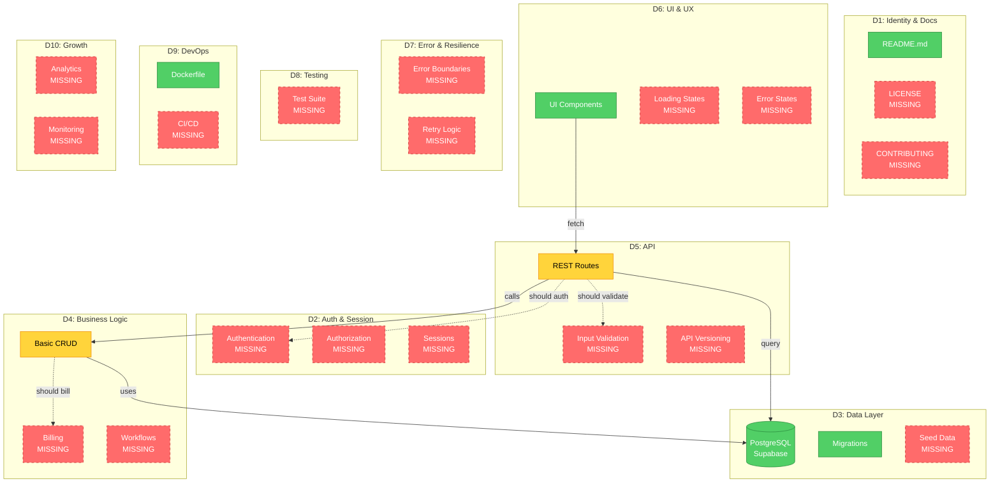
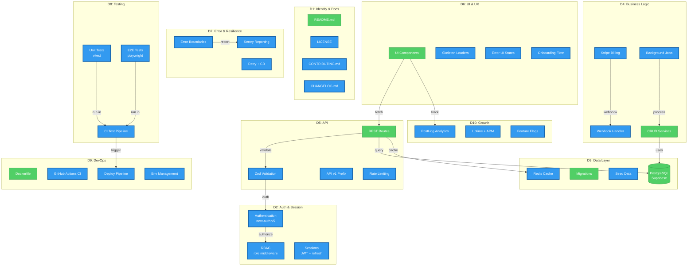

# Output Templates — Project Completeness Scorecard

> Mandatory output formats for project-rx evaluations. Every evaluation MUST include all 7 sections
> in the exact order specified. This is the most detailed output template in the rx family.
> The output must be immediately actionable — someone should be able to read it and know EXACTLY
> what to build next.

---

## Section 1: Archetype Detection Summary

Detect the project archetype FIRST, before scoring. The archetype determines weight adjustments
and which components are considered blockers vs N/A.

### Format

```markdown
## Project Archetype: [DETECTED TYPE]

**Confidence: [HIGH/MEDIUM/LOW]**

**Signals detected**:
- [signal 1 — e.g., "stripe dependency in package.json"]
- [signal 2 — e.g., "multi-tenant schema with org_id foreign keys"]
- [signal 3 — e.g., "subscription billing tables in migrations"]
- [signal 4 — e.g., "dashboard routes under /app/*"]

**Alternative archetypes considered**:
- [Type B] — rejected because [reason]
- [Type C] — rejected because [reason]

**Weight adjustments applied**:
| Dimension | Default Weight | Factor | Effective Weight | Reason |
|-----------|---------------|--------|-----------------|--------|
| D1 Identity & Docs | 10% | 1.0x | 10% | — |
| D2 Auth & Session | 12% | 1.2x | 14.4% | Multi-tenant requires strong auth |
| D3 Data Layer | 12% | 1.0x | 12% | — |
| D4 Business Logic | 12% | 1.5x | 18% | Billing is core for SaaS |
| D5 API & Integration | 10% | 0.8x | 8% | Internal-facing API |
| D6 UI & UX | 10% | 1.0x | 10% | — |
| D7 Error & Resilience | 8% | 1.0x | 8% | — |
| D8 Testing & QA | 8% | 1.0x | 8% | — |
| D9 DevOps & Infra | 10% | 0.8x | 8% | Standard deployment |
| D10 Growth & Scale | 8% | 0.5x | 4% | Not yet critical |

> Note: Effective weights are re-normalized to sum to 100% after adjustment.
```

### Archetype Detection Rules

1. **Scan dependencies first.** Package managers reveal intent (stripe = billing, next-auth = auth, etc.).
2. **Scan schema/migrations second.** Table names and relationships reveal domain.
3. **Scan routes/endpoints third.** URL patterns reveal product type.
4. **Minimum 3 signals for HIGH confidence.** 2 signals = MEDIUM. 1 signal = LOW.
5. **If LOW confidence, state the assumption and note it may affect scoring accuracy.**

---

## Section 2: Completeness Scorecard

The summary table with status indicators for quick scanning.

### Format

```markdown
## Project Completeness Scorecard

**Project**: [name]
**Stack**: [e.g., Next.js 14 + TypeScript + Supabase + Tailwind]
**Archetype**: [detected type]
**Overall Score**: [0-100] — [GRADE]

| # | Dimension | Score | Grade | Status | Sub-Metrics Summary |
|---|-----------|-------|-------|--------|---------------------|
| D1 | Identity & Docs | 72 | B- | ⚠️ Partial | README present, no LICENSE, no CONTRIBUTING |
| D2 | Auth & Session | 0 | F | ❌ Missing | No auth system detected |
| D3 | Data Layer | 88 | A- | ✅ Present | Supabase + migrations, no seed data |
| D4 | Business Logic | 35 | D | ⚠️ Partial | Basic CRUD only, no billing |
| D5 | API & Integration | 61 | C | ⚠️ Partial | REST routes, no validation, no versioning |
| D6 | UI & UX | 78 | B | ⚠️ Partial | Components exist, no loading/error states |
| D7 | Error & Resilience | 15 | F | ❌ Missing | No error boundaries, no retry logic |
| D8 | Testing & QA | 0 | F | ❌ Missing | No test files found |
| D9 | DevOps & Infra | 42 | D+ | ⚠️ Partial | Dockerfile present, no CI/CD |
| D10 | Growth & Scale | 10 | F | ❌ Missing | No analytics, no monitoring |
```

### Status Column Rules

| Status | Condition | Meaning |
|--------|-----------|---------|
| ✅ Present | Score >= 85 | Dimension is adequately implemented |
| ⚠️ Partial | Score 40-84 | Some components exist but gaps remain |
| ❌ Missing | Score 0-39 | Critical gaps, major work needed |
| ➖ N/A | Archetype excludes | Not applicable for this project type |

---

## Section 3: Sub-Metric Detail

Expand every dimension into its sub-metrics with evidence from the codebase.

### Format

```markdown
## Sub-Metric Detail

### D1: Identity & Docs — 72/100 (B-)

| Sub-Metric | Score | Evidence |
|------------|-------|----------|
| M1.1 README quality | 80 | README.md exists, has setup instructions, missing architecture section |
| M1.2 LICENSE | 0 | No LICENSE file found |
| M1.3 CONTRIBUTING guide | 0 | No CONTRIBUTING.md |
| M1.4 Project metadata | 100 | package.json has name, version, description, repository |
| M1.5 Changelog | 0 | No CHANGELOG.md, no conventional commits |

### D2: Auth & Session — 0/100 (F)

| Sub-Metric | Score | Evidence |
|------------|-------|----------|
| M2.1 Authentication | 0 | No auth library detected, no login routes |
| M2.2 Authorization / RBAC | 0 | No role checks, no permission middleware |
| M2.3 Session management | 0 | No session storage, no JWT handling |
| M2.4 Password / credential security | 0 | N/A — no auth system |

[... continue for all 10 dimensions ...]
```

### Sub-Metric Scoring Rules

1. **Score 0** — Component does not exist at all. No files, no config, no imports.
2. **Score 1-39** — Minimal placeholder or stub exists but is non-functional.
3. **Score 40-69** — Basic implementation exists with significant gaps.
4. **Score 70-84** — Solid implementation with minor gaps.
5. **Score 85-96** — Production-ready with only polish needed.
6. **Score 97-100** — Best-in-class implementation.
7. **Every score MUST cite evidence.** File paths, dependency names, or explicit absence.

---

## Section 4: Missing Components — Build Plan (THE KEY OUTPUT)

This is the unique value of project-rx. Each missing or partial component gets a detailed,
actionable build specification. Someone should be able to hand this to a developer and say "build this."

### Format

```markdown
## Missing Components — Build Plan

> [N] components identified across [M] dimensions.
> Estimated total effort: [X] weeks for a single developer.

---

### 🔴 Blockers (must build before launch)

> These components are required for the project to function as a [archetype].
> Without them, the project cannot serve its core purpose.

#### MISSING-001: Authentication System
- **Dimension**: D2 Auth & Session
- **Status**: ❌ Not present
- **Priority**: Blocker
- **Current score impact**: D2 = 0/100 (dragging overall by ~12 points)
- **Why this is critical**: A [SaaS Web App] without authentication cannot identify users,
  enforce tenancy, or protect data. Every other feature depends on knowing who the user is.
- **What to build**:
  - [ ] User registration flow (email + password)
  - [ ] Email verification with magic link
  - [ ] Login / logout with session persistence
  - [ ] Password reset via email
  - [ ] Session management (JWT with refresh tokens OR httpOnly cookies)
  - [ ] Social OAuth providers (Google, GitHub minimum)
  - [ ] Rate limiting on auth endpoints (prevent brute force)
  - [ ] Account lockout after N failed attempts
- **Suggested approach**: Use `next-auth` v5 (Auth.js) with Supabase adapter. Leverage
  Supabase Auth for the heavy lifting, wrap with middleware for route protection.
- **Key files to create**:
  - `src/lib/auth.ts` — auth configuration
  - `src/app/api/auth/[...nextauth]/route.ts` — auth API route
  - `src/middleware.ts` — route protection middleware
  - `src/app/(auth)/login/page.tsx` — login page
  - `src/app/(auth)/register/page.tsx` — registration page
  - `src/app/(auth)/reset-password/page.tsx` — password reset
- **Key dependencies**: `next-auth@5`, `@auth/supabase-adapter`
- **Effort**: M (3-5 days)
- **Score impact**: D2: 0 → ~75 (+75), Overall: +~9 points
- **After building, run**: `/sec-rx` to verify auth security (D2 Auth & Session)

---

#### MISSING-002: [Next Component Name]
[... same format ...]

---

### 🟠 Critical (should build for production)

> These components are not strictly required to function, but deploying without them
> creates significant risk (data loss, security holes, poor reliability).

#### MISSING-005: Error Handling & Boundaries
- **Dimension**: D7 Error & Resilience
- **Status**: ❌ Not present (score: 15)
- **Priority**: Critical
- **Why**: Unhandled errors in production cause white screens, data corruption, and lost users.
  A production [SaaS Web App] needs graceful degradation.
- **What to build**:
  - [ ] Global error boundary component (`error.tsx` per route group)
  - [ ] Not-found pages (`not-found.tsx` per route group)
  - [ ] API error response standardization (consistent error schema)
  - [ ] Client-side error reporting (Sentry or similar)
  - [ ] Server-side error logging with correlation IDs
  - [ ] Retry logic for external API calls (LLM, email, payment)
  - [ ] Circuit breaker for flaky external services
  - [ ] Graceful degradation UI (fallback content when services fail)
- **Suggested approach**: Next.js error boundaries + Sentry SDK + custom retry wrapper
- **Key files to create**:
  - `src/app/error.tsx` — root error boundary
  - `src/app/not-found.tsx` — root 404
  - `src/lib/errors.ts` — error types and formatting
  - `src/lib/retry.ts` — retry/circuit-breaker utility
  - `src/lib/sentry.ts` — error reporting setup
- **Key dependencies**: `@sentry/nextjs`
- **Effort**: M (3-5 days)
- **Score impact**: D7: 15 → ~80 (+65), Overall: +~5 points
- **After building, run**: `/code-rx` to verify error handling patterns

---

### 🟡 High (important for growth)

> These components improve user experience, developer experience, or operational visibility.
> Not blocking launch but should be built within the first month.

#### MISSING-008: [Component Name]
[... same format ...]

---

### 🔵 Medium (nice to have)

> These components add polish, improve maintainability, or prepare for scale.
> Build when bandwidth allows.

#### MISSING-012: [Component Name]
[... same format ...]

---

### ⚪ Low (future consideration)

> These components are aspirational. They matter at scale or for enterprise customers.
> Plan for them but do not block on them.

#### MISSING-015: [Component Name]
[... same format ...]
```

### Priority Classification Rules

| Priority | Criteria | Typical Components |
|----------|----------|--------------------|
| 🔴 Blocker | Cannot function as [archetype] without it | Auth, core CRUD, data model, primary UI |
| 🟠 Critical | Significant risk if missing in production | Error handling, input validation, backups, logging |
| 🟡 High | Important for growth / retention | Analytics, monitoring, email, search, onboarding |
| 🔵 Medium | Improves quality of life | Admin panel, feature flags, API docs, i18n |
| ⚪ Low | Future scale / enterprise | Multi-region, advanced caching, audit logs, SSO |

### MISSING-ID Numbering Rules

1. IDs are sequential: MISSING-001, MISSING-002, etc.
2. Ordered by priority tier first, then by score impact within tier.
3. Each ID is unique across the entire output.
4. Reference IDs in the Build Roadmap (Section 6) and Mermaid diagrams (Section 5).

---

## Section 5: Project Architecture Diagrams (Before/After Mermaid)

For project-rx, the Mermaid diagrams show the PROJECT ARCHITECTURE — what exists vs what
should exist. These are structural diagrams, not flow diagrams.

### Before Diagram — Current Architecture

Shows existing components as solid nodes and missing components as dashed nodes.
Group by the 10 dimensions using subgraphs.

````markdown
### Project Architecture: Before (Current State — [SCORE] [GRADE])


````

### After Diagram — Target Architecture

Shows the complete system with all components present and connected.

````markdown
### Project Architecture: After (Target — 95+ A)


````

### Diagram Construction Rules

1. **Both diagrams are mandatory.** Never output a scorecard without Before/After diagrams.
2. **Before diagram must reflect actual codebase.** Derive from discovery, not hypothetical.
3. **After diagram must match the build plan.** Every planned node corresponds to a MISSING-NNN item.
4. **Use consistent node IDs.** Same component keeps the same ID across both diagrams.
5. **classDef usage**:
   - `present` (green, solid) — component exists and scores >= 85
   - `partial` (orange, solid) — component exists but has gaps (score 40-84)
   - `missing` (red, dashed) — component does not exist (score 0-39)
   - `planned` (blue, thick border) — component to be built (After diagram only)
   - `na` (grey) — not applicable for this archetype
6. **Subgraph boundaries = dimensions.** Use `D1`, `D2`, etc. as subgraph labels.
7. **Maximum 25 nodes per diagram.** Focus on most impactful areas if architecture is large.
8. **Dashed arrows (`-.->`)** in Before diagram show missing connections.
9. **Solid arrows (`-->`)** in After diagram show all connections are complete.
10. **Include MISSING label** on missing nodes in the Before diagram for visual clarity.

---

## Section 6: Build Roadmap

A phased plan that groups MISSING-NNN items into logical build phases with dependency ordering.

### Format

```markdown
## Build Roadmap

| Phase | Name | Duration | Components (MISSING-IDs) | Dependencies | Score After Phase |
|-------|------|----------|--------------------------|--------------|-------------------|
| 0 | Current State | — | What exists today | — | 38 (D+) |
| 1 | Foundation | 2 weeks | MISSING-001 (Auth), MISSING-003 (Validation), MISSING-007 (Error Boundaries) | — | 55 (C) |
| 2 | Core Business | 3 weeks | MISSING-002 (Billing), MISSING-004 (Webhooks), MISSING-006 (Background Jobs) | Phase 1 (Auth) | 72 (B-) |
| 3 | Quality & Safety | 2 weeks | MISSING-008 (Unit Tests), MISSING-009 (E2E Tests), MISSING-010 (CI/CD) | Phase 2 (features to test) | 82 (B) |
| 4 | Polish & UX | 2 weeks | MISSING-011 (Loading States), MISSING-012 (Onboarding), MISSING-013 (Error UI) | Phase 1 (Auth for onboarding) | 89 (A-) |
| 5 | Growth & Scale | 2 weeks | MISSING-014 (Analytics), MISSING-015 (Monitoring), MISSING-016 (Feature Flags) | Phase 3 (CI for deploys) | 95 (A) |

### Phase Details

#### Phase 1: Foundation (Weeks 1-2)
**Goal**: Users can sign up, data is validated, errors are caught.

| Component | Effort | Owner Skill | Key Acceptance Criteria |
|-----------|--------|-------------|------------------------|
| MISSING-001: Auth | M (3-5d) | — | Users can register, login, logout; sessions persist |
| MISSING-003: Validation | S (1-2d) | — | All API inputs validated with Zod; errors return 400 |
| MISSING-007: Error Boundaries | S (1-2d) | — | Every route group has error.tsx; no white screens |

**Phase 1 score projection**: 38 → 55 (+17 points)

[... continue for each phase ...]
```

### Roadmap Construction Rules

1. **Phase 0 is always "Current State."** Shows what exists and current score.
2. **Dependencies are real.** Auth must exist before billing (needs user context).
3. **Each phase has a clear goal statement.** One sentence describing the milestone.
4. **Score projections are based on MISSING-NNN score impacts.** Sum the deltas.
5. **Maximum 5-6 phases.** If more work is needed, collapse lower-priority items.
6. **Duration assumes a single developer.** Note "parallelize for faster delivery" if applicable.
7. **Final phase should project to A- or higher (89+).**

---

## Section 7: rx Pipeline Recommendation

Based on what exists and what's being built, recommend which other rx skills to run and when.

### Format

```markdown
## Recommended rx Pipeline

Based on the current state and build plan, run these rx evaluations in order:

| Order | Skill | Target | Why | When |
|-------|-------|--------|-----|------|
| 1 | `/code-rx` | Existing codebase | Establish code quality baseline before building more. Fix patterns now so new code follows them. | Now (before building) |
| 2 | `/sec-rx` | D2 Auth implementation | Verify auth system security — token handling, password hashing, session management. | After Phase 1 |
| 3 | `/api-rx` | D5 API routes | Validate API design, error responses, input validation patterns. | After Phase 1 |
| 4 | `/arch-rx` | Full system | Architecture patterns, separation of concerns, scalability. Needs core features present. | After Phase 2 |
| 5 | `/test-rx` | D8 Test suite | Verify test coverage, test quality, CI integration. | After Phase 3 |
| 6 | `/ux-rx` | D6 UI & UX | Evaluate user flows, accessibility, loading/error states. | After Phase 4 |
| 7 | `/ops-rx` | D9 DevOps | Verify CI/CD, monitoring, deployment, infrastructure. | After Phase 5 |
| 8 | `/doc-rx` | D1 Documentation | Final docs review — API docs, architecture docs, contributor guide. | After Phase 5 |

### Skip List
These rx skills are not recommended for this project type:
- `/[skill]` — [reason it's not applicable]
```

### Pipeline Recommendation Rules

1. **Always recommend `/code-rx` first.** Code quality baseline before new development.
2. **Match rx skills to build phases.** Run `/sec-rx` after building auth, not before.
3. **Order by dependency.** Architecture review needs features to review.
4. **Include a skip list** for rx skills that don't apply to the archetype.
5. **Maximum 8 recommendations.** Prioritize by impact.

---

## Section 8: Complete Output Order

The final project-rx output MUST follow this exact sequence:

```
1. Archetype Detection Summary (Section 1)
2. Completeness Scorecard — 10 dimensions (Section 2)
3. Sub-Metric Detail — all sub-metrics with evidence (Section 3)
4. Missing Components — Build Plan (Section 4) ← THE KEY OUTPUT
5. Project Architecture: Before (Mermaid — existing vs missing) (Section 5)
6. Project Architecture: After (Mermaid — complete system) (Section 5)
7. Build Roadmap — phased plan with score projections (Section 6)
8. rx Pipeline Recommendation (Section 7)
```

### Output Rules

1. **All 8 sections are mandatory.** Never skip a section.
2. **Section 4 (Build Plan) is the key differentiator.** Spend the most effort here.
3. **Every MISSING-NNN in Section 4 must appear in Section 6 (Roadmap).**
4. **Every planned node in Section 5 (After diagram) must have a MISSING-NNN.**
5. **Scores are internally consistent.** Dimension scores, sub-metric scores, and overall score must reconcile.
6. **Evidence is mandatory.** Every score cites file paths, dependencies, or explicit absence.
7. **Effort estimates are mandatory.** S (< 1 day), M (1-5 days), L (5+ days).
8. **Score impact projections are mandatory.** Show before/after for each MISSING item and each phase.
