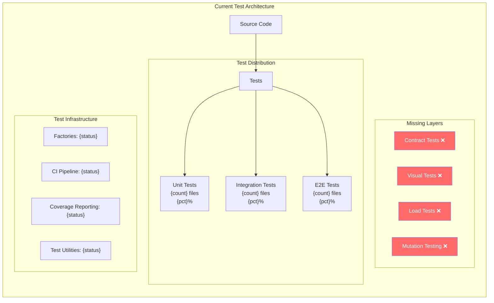
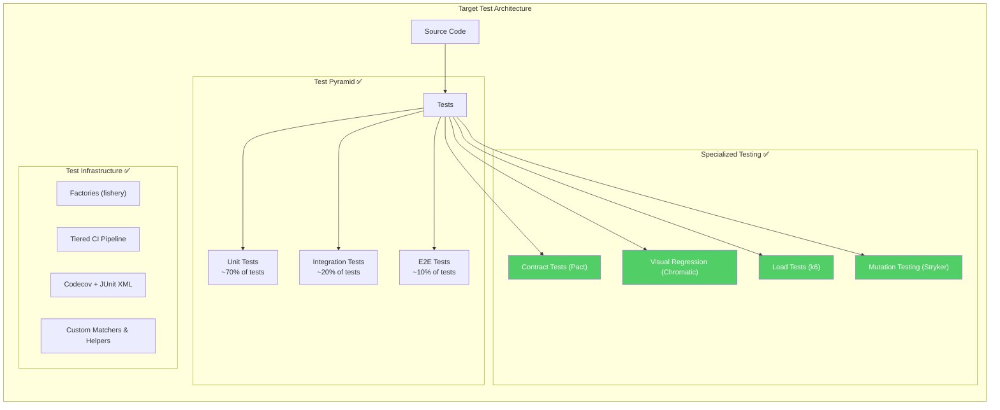
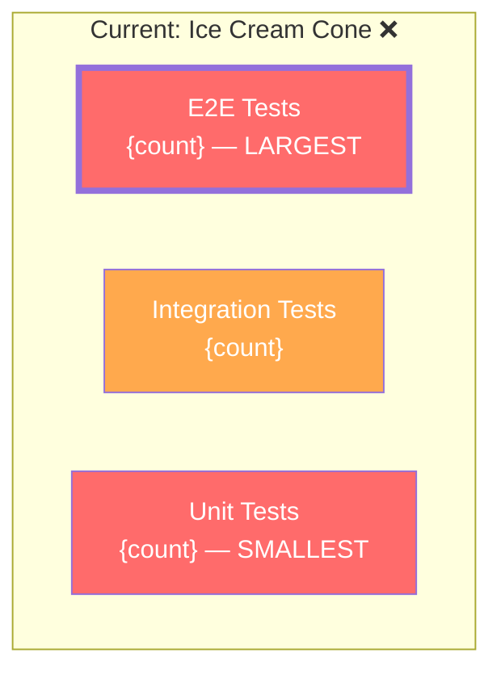
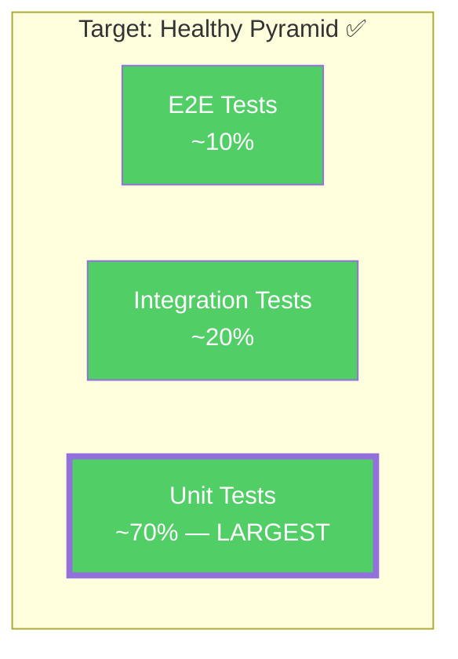
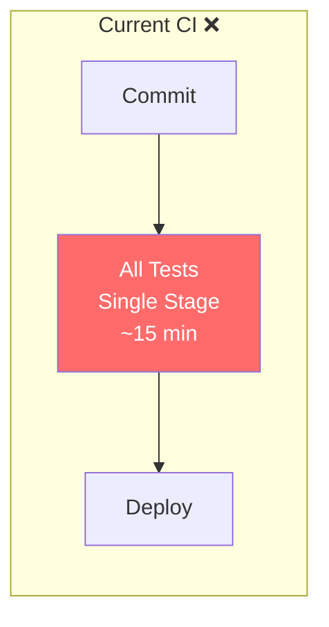
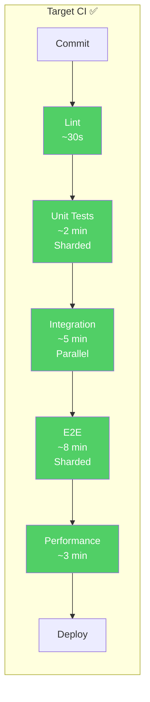
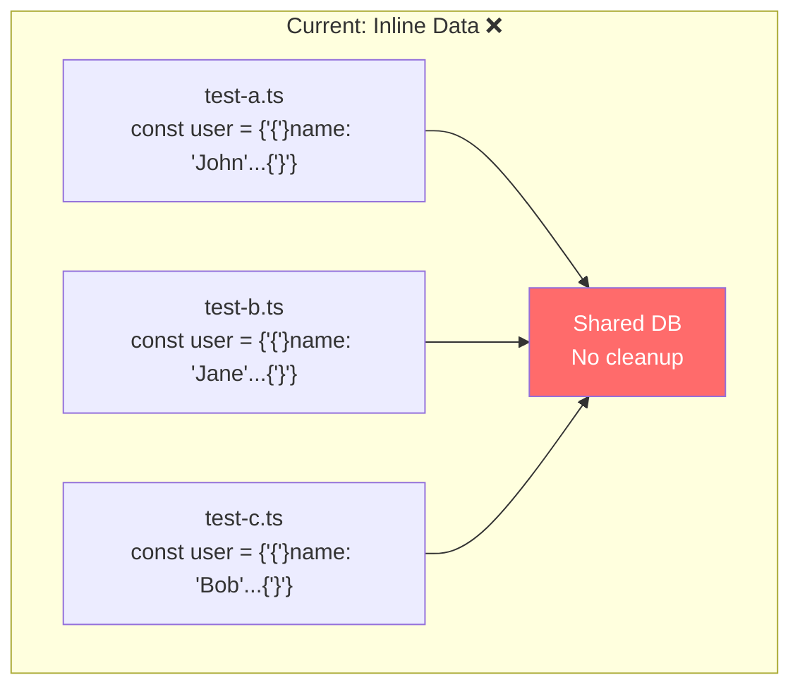
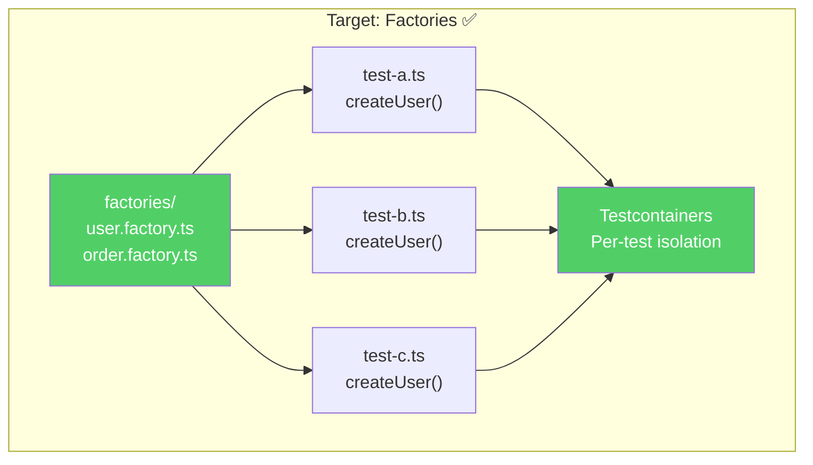

# test-rx Output Templates

## Per-Dimension Improvement Plans

Each dimension scoring below 7/10 receives a structured improvement plan.

---

### Template: Dimension Improvement Plan

```markdown
## {Dimension Name} — Current Score: {score}/10

### Gap Analysis
- **Current state:** {description of what exists}
- **Target state:** {description of what good looks like}
- **Gap:** {specific missing capabilities}

### Priority Actions (ordered by impact)

1. **[HIGH] {Action title}**
   - What: {concrete action}
   - Why: {impact on testing strategy}
   - How: {implementation steps}
   - Effort: {S/M/L}
   - Files to create/modify: {list}

2. **[MEDIUM] {Action title}**
   - What: {concrete action}
   - Why: {impact}
   - How: {steps}
   - Effort: {S/M/L}

3. **[LOW] {Action title}**
   - What: {concrete action}
   - Why: {impact}
   - How: {steps}
   - Effort: {S/M/L}

### Quick Wins (< 1 day)
- [ ] {action}
- [ ] {action}

### Strategic Investments (1-2 weeks)
- [ ] {action}
- [ ] {action}
```

---

## Before/After Mermaid Diagrams

### Test Architecture Transformation

Use these diagram templates to visualize the current vs target test architecture.

#### Before: Current Test Architecture



#### After: Target Test Architecture



---

### Test Pyramid Shape Diagram

#### Before: Ice Cream Cone Anti-Pattern



#### After: Healthy Pyramid



---

### CI Pipeline Transformation

#### Before: Single-Stage Pipeline



#### After: Tiered Pipeline



---

### Test Data Management Transformation

#### Before: Inline Data Chaos



#### After: Factory-Based Data Management



---

## Full Scorecard Template

```markdown
============================================================
  TEST-RX DIAGNOSTIC SCORECARD
  Project: {project_name}
  Date: {date}
  Final Score: {score}/100 — Grade: {grade}
============================================================

  D1  Test Pyramid Balance     {bar}  {score}/10  (15%)
      M1.1 Unit test ratio ............ {score}/10
      M1.2 Integration test coverage .. {score}/10
      M1.3 E2E test coverage .......... {score}/10
      M1.4 Pyramid shape .............. {score}/10

  D2  Test Effectiveness       {bar}  {score}/10  (15%)
      M2.1 Mutation score ............. {score}/10
      M2.2 Assertion density .......... {score}/10
      M2.3 Test-to-code coupling ...... {score}/10
      M2.4 False positive rate ........ {score}/10

  D3  Contract & API Testing   {bar}  {score}/10  (10%)
      M3.1 Contract test coverage ..... {score}/10
      M3.2 Schema validation tests .... {score}/10
      M3.3 API integration tests ...... {score}/10
      M3.4 Backward compatibility ..... {score}/10

  D4  UI & Visual Testing      {bar}  {score}/10  (10%)
      M4.1 Component tests ............ {score}/10
      M4.2 Visual regression .......... {score}/10
      M4.3 Accessibility testing ...... {score}/10
      M4.4 Cross-browser testing ...... {score}/10

  D5  Performance & Load       {bar}  {score}/10  (10%)
      M5.1 Load test existence ........ {score}/10
      M5.2 Performance budgets ........ {score}/10
      M5.3 Benchmark tests ............ {score}/10
      M5.4 Stress & soak tests ........ {score}/10

  D6  Test Data Management     {bar}  {score}/10  (15%)
      M6.1 Test factories ............. {score}/10
      M6.2 Database isolation ......... {score}/10
      M6.3 Seed data management ....... {score}/10
      M6.4 Mock & stub quality ........ {score}/10

  D7  CI Integration           {bar}  {score}/10  (15%)
      M7.1 Test parallelization ....... {score}/10
      M7.2 Fail-fast strategy ......... {score}/10
      M7.3 Test caching ............... {score}/10
      M7.4 Test reporting ............. {score}/10

  D8  Test Organization        {bar}  {score}/10  (10%)
      M8.1 Test file structure ........ {score}/10
      M8.2 Test naming conventions .... {score}/10
      M8.3 Shared test utilities ...... {score}/10
      M8.4 Test documentation ......... {score}/10

  WEIGHTED TOTAL: {total}/100

  Grade Scale:
    90-100  A  Exemplary testing strategy
    80-89   B  Strong with minor gaps
    70-79   C  Adequate, clear improvement areas
    60-69   D  Significant strategy gaps
    <60     F  Testing strategy needs overhaul

============================================================
  TOP 3 CRITICAL FINDINGS
============================================================
  1. {finding with file references}
  2. {finding with file references}
  3. {finding with file references}

============================================================
  IMPROVEMENT ROADMAP
============================================================
  Phase 1 (Quick Wins — This Sprint):
    - [ ] {action}
    - [ ] {action}
    - [ ] {action}

  Phase 2 (Foundation — Next 2 Sprints):
    - [ ] {action}
    - [ ] {action}
    - [ ] {action}

  Phase 3 (Strategic — Next Quarter):
    - [ ] {action}
    - [ ] {action}
    - [ ] {action}
============================================================
```

---

## Dimension-Specific Output Sections

### D1 Output: Test Pyramid Analysis

```markdown
### Test Pyramid Analysis

| Layer | Count | Percentage | Target | Status |
|-------|-------|-----------|--------|--------|
| Unit | {n} | {pct}% | >= 70% | {ok/gap} |
| Integration | {n} | {pct}% | ~20% | {ok/gap} |
| E2E | {n} | {pct}% | ~10% | {ok/gap} |

Shape: {Pyramid / Diamond / Hourglass / Ice Cream Cone}
```

### D6 Output: Test Data Audit

```markdown
### Test Data Audit

| Pattern | Count | Files | Quality |
|---------|-------|-------|---------|
| Factory usage | {n} | {files} | {good/poor} |
| Inline literals | {n} | {files} | {concern level} |
| Mock factories | {n} | {files} | {good/poor} |
| DB cleanup hooks | {n} | {files} | {good/poor} |

Over-mocking risk: {LOW / MEDIUM / HIGH}
```

### D7 Output: CI Integration Audit

```markdown
### CI Pipeline Analysis

| Stage | Present | Order | Duration |
|-------|---------|-------|----------|
| Lint | {y/n} | {pos} | {est} |
| Unit Tests | {y/n} | {pos} | {est} |
| Integration | {y/n} | {pos} | {est} |
| E2E | {y/n} | {pos} | {est} |
| Performance | {y/n} | {pos} | {est} |

Parallelization: {none / basic / sharded}
Caching: {none / deps / results / affected-only}
Reporting: {none / console / junit / coverage+trends}
```
