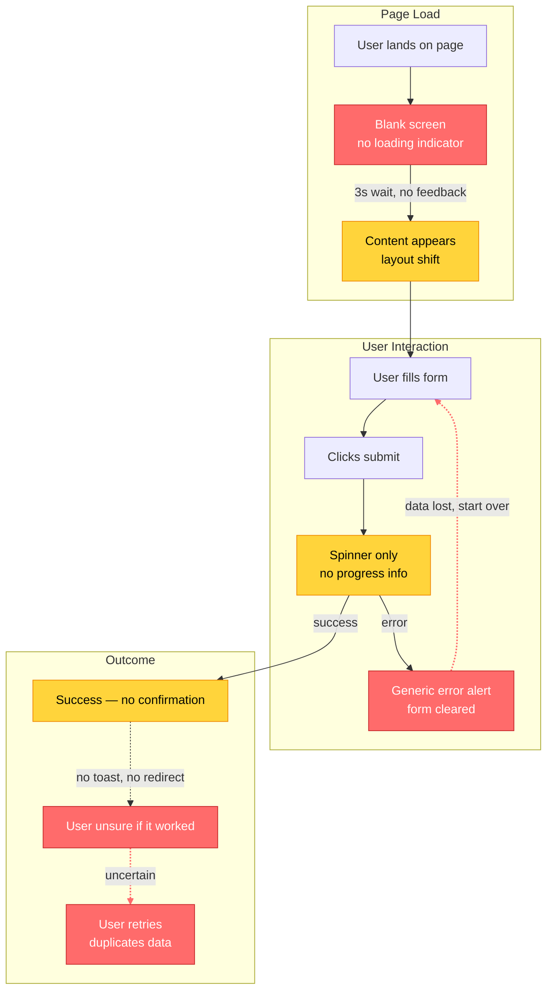
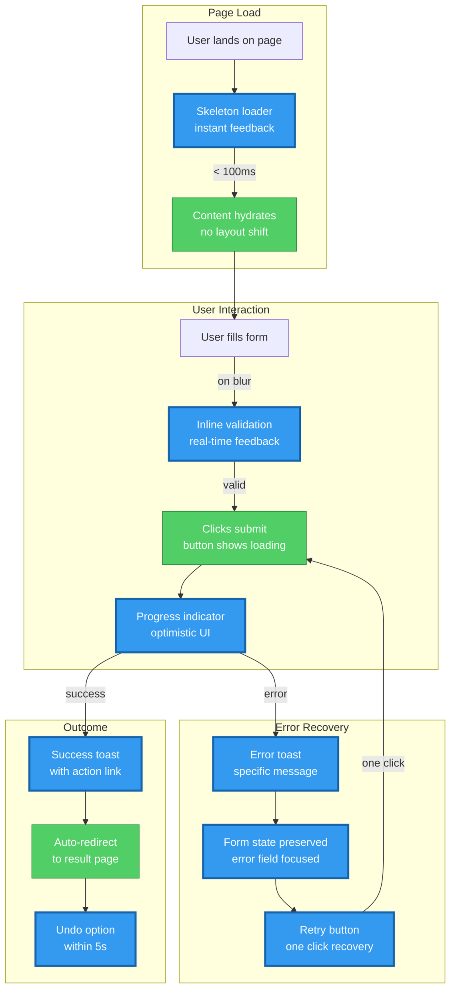

# Output Templates — Improvement Plan & User Flow Diagrams

> Mandatory output formats for ux-rx scorecards. Every evaluation MUST include:
> 1. The scorecard (defined in SKILL.md)
> 2. Per-dimension improvement plan (this file, Section 1)
> 3. Before/After Mermaid user flow diagrams (this file, Section 2)

---

## Section 1: Per-Dimension Improvement Plan

After the UX Opportunity Map and before the User Flow diagrams, include a detailed improvement plan
for EVERY dimension scoring below 97 (A+).

### Format

```markdown
## Improvement Plan: D[N] [Dimension Name] — [Current Score] → 97+ (A+)

### Current State ([Grade])
[1-2 sentence summary of what users currently experience, citing evidence from discovery]

### Gap Analysis
| Sub-Metric | Current | Target | Gap | Key Blocker |
|------------|---------|--------|-----|-------------|
| M[N].1 [name] | [score] | 97+ | [delta] | [specific component/route/pattern blocking improvement] |
| M[N].2 [name] | [score] | 97+ | [delta] | [specific blocker] |
| M[N].3 [name] | [score] | 97+ | [delta] | [specific blocker] |
| M[N].4 [name] | [score] | 97+ | [delta] | [specific blocker] |

### Improvement Steps (ordered by impact)

#### Step 1: [Action] → M[N].X +[N] points
- **What**: [Concrete UX improvement — e.g., "Add inline validation with real-time feedback to login form"]
- **Where**: [File paths and routes to modify — e.g., `app/(auth)/login/page.tsx`, `components/forms/login-form.tsx`]
- **Heuristic**: [Framework reference — e.g., "Nielsen #9 Help Users Recognize and Recover from Errors", "WCAG 3.3.1 Error Identification", "Laws of UX — Postel's Law"]
- **shadcn Component**: [Registry component if applicable — e.g., "`Form` + `FormField` + `FormMessage` — install: `npx shadcn@latest add form`"]
- **Acceptance Criteria**:
  - [ ] [Measurable UX outcome 1 — e.g., "Validation errors appear inline within 300ms of blur"]
  - [ ] [Measurable UX outcome 2 — e.g., "Error count drops to 0 before submit is enabled"]
  - [ ] [Measurable UX outcome 3 — e.g., "Screen reader announces errors via aria-describedby"]
- **Effort**: [S/M/L]

#### Step 2: [Action] → M[N].Y +[N] points
[... same format ...]

### Target State ([A+])
[1-2 sentence description of what the user experience looks like after all steps complete]
```

### Rules for Improvement Plans

1. **Every dimension below 97 gets a plan.** No exceptions.
2. **Steps are ordered by point impact.** Highest delta first within each dimension.
3. **Acceptance criteria are measurable UX outcomes.** "Improve loading" is not acceptable. "Skeleton loader appears within 100ms, content replaces skeleton within LCP budget of 2.5s" is.
4. **File paths and routes are mandatory.** Every step must reference the specific files/routes affected.
5. **Heuristic reference is mandatory.** Every step cites Nielsen, WCAG, Laws of UX, Core Web Vitals, or Baymard.
6. **shadcn component is mandatory when applicable.** Include the exact `npx shadcn@latest add` command. Write "N/A — custom implementation" only when no registry component fits.
7. **Effort sizing is mandatory.** S = < 1 day, M = 1-3 days, L = 3+ days.

---

## Section 2: Before/After Mermaid User Flow Diagrams

Every scorecard MUST include two Mermaid diagrams showing the **user journey transformation**.
These diagrams show USER FLOW (actions, responses, wait states, errors), NOT infrastructure.
Place these after the Improvement Plans and before the Roadmap to A+.

### Before Diagram — Current User Flow

Shows the user journey AS-IS with pain points highlighted.

Use these conventions:
- **Red nodes** (`:::danger`) for bad UX (broken, confusing, inaccessible)
- **Orange nodes** (`:::warning`) for mediocre UX (works but frustrating)
- **Green nodes** (`:::success`) for good UX (clear, fast, accessible)
- **Blue nodes** (`:::info`) for system responses / automated steps
- **Dashed lines** (`-.->`) for missing feedback or dead ends
- **Bold labels** on edges for wait times, error rates, or user confusion points
- Subgraphs for logical journey phases
- Use `flowchart TB` or `flowchart LR` depending on flow complexity

Template:

````markdown
### User Flow: Before (Current State — [SCORE] [GRADE])


````

### After Diagram — Target A+ User Flow

Shows the user journey AFTER implementing all improvement plan steps.

Use these conventions:
- **Green nodes** (`:::success`) for improved existing steps
- **Blue nodes** (`:::new`) for new UX components/patterns added
- **Solid lines** for all connections — no dead ends
- **Edge labels** showing response times and feedback mechanisms
- Subgraphs match the improved journey phases

Template:

````markdown
### User Flow: After (Target — 97+ A+)


````

### Flow Diagram Examples by UX Pattern

#### Form Submission Flow

Before (bad UX):
```
User types → No validation → Submit → Spinner → Generic error → Form cleared → Start over
```

After (A+ UX):
```
User types → Inline validation (on blur) → Submit (disabled until valid) → Optimistic UI → Success toast + redirect
                                                                          ↳ Error toast → Form preserved → Retry button
```

#### Data Loading Flow

Before (bad UX):
```
Navigate → Blank page (3s) → Content appears (layout shift) → User scrolls → More blank → Content loads
```

After (A+ UX):
```
Navigate → Skeleton (instant) → Content streams in (no shift) → User scrolls → Prefetched content ready → Infinite scroll with loading indicator
```

#### Error Recovery Flow

Before (bad UX):
```
Action fails → alert("Something went wrong") → User clicks OK → Page in broken state → User refreshes → Lost context
```

After (A+ UX):
```
Action fails → Error boundary catches → Contextual error card with retry → Retry succeeds → State restored → Toast confirms recovery
```

### Diagram Construction Rules

1. **Both diagrams are mandatory.** Never output a scorecard without Before/After user flow diagrams.
2. **Before diagram must show real user journeys.** Derive from discovery output and actual routes, not hypothetical flows.
3. **After diagram must match the improvement plan.** Every new node in the diagram must correspond to an improvement step. No phantom components.
4. **Use consistent node IDs.** Same user action keeps the same ID in both diagrams for visual comparison.
5. **Show user perspective, not system internals.** Nodes represent what the user sees/does, not API calls or database queries.
6. **Annotate timing on edges.** Show response times, wait durations, and feedback delays (e.g., "< 100ms", "3s wait", "on blur").
7. **Color-code by UX quality.** Before diagram uses danger/warning/success/dead. After diagram should be all success/new.
8. **Subgraph boundaries = journey phases.** Group by user journey stage (Entry, Interaction, Error Recovery, Outcome, Navigation).
9. **Maximum 20 nodes per diagram.** If the flow is larger, focus on the most impactful transformation area and note what is omitted.
10. **Show error paths explicitly.** Every flow must include the error/edge case path, not just the happy path.
11. **Include dead ends in Before.** Use dashed lines (`-.->`) and `:::dead` class for places where users get stuck or confused.
12. **Eliminate all dead ends in After.** Every path must lead to a clear resolution or recovery.

### Diagram Variations by Flow Type

#### Multi-Page Form — Use `flowchart LR` (left-to-right, step progression)

```
flowchart LR
    subgraph Step1["Step 1: Info"]
        ...
    end
    subgraph Step2["Step 2: Details"]
        ...
    end
    subgraph Step3["Step 3: Review"]
        ...
    end
    Step1 -->|"next"| Step2
    Step2 -->|"next"| Step3
    Step2 -->|"back"| Step1
```

#### Dashboard Navigation — Use `flowchart TB` with sidebar + content areas

```
flowchart TB
    subgraph Nav["Navigation"]
        SIDEBAR[Sidebar menu]
        BREADCRUMB[Breadcrumbs]
    end
    subgraph Content["Content Area"]
        LIST[List view]
        DETAIL[Detail view]
        MODAL[Modal/Dialog]
    end
    SIDEBAR --> LIST
    LIST -->|"row click"| DETAIL
    DETAIL -->|"action"| MODAL
    BREADCRUMB -->|"back"| LIST
```

#### Search & Filter — Use `flowchart LR` with feedback loops

```
flowchart LR
    QUERY[User types query] --> SUGGEST[Autocomplete suggestions]
    SUGGEST --> SELECT[Select suggestion]
    SELECT --> RESULTS[Filtered results]
    RESULTS --> REFINE[Refine filters]
    REFINE --> RESULTS
    RESULTS --> EMPTY[Empty state + suggestions]
```

#### Error Boundary Cascade — Use `flowchart TB` with recovery paths

```
flowchart TB
    ACTION[User action] --> COMPONENT[Component error]
    COMPONENT --> BOUNDARY[Error boundary catches]
    BOUNDARY --> CARD[Error card with context]
    CARD --> RETRY[Retry button]
    CARD --> FALLBACK[Fallback content]
    RETRY -->|"success"| RESTORED[State restored]
    RETRY -->|"fail again"| ESCALATE[Page-level error + support link]
```

---

## Section 3: Complete Output Structure

The final scorecard output MUST follow this order:

```
1. Header (target, overall score/grade, stack: Next.js + shadcn/ui + Tailwind)
2. Dimension Summary Table (11 rows with weights, scores, grades, biggest opportunity)
3. Sub-Metric Detail (all 44 sub-metrics across 11 dimensions)
4. shadcn Registry Opportunities (components to add/replace, with install commands)
5. UX Opportunity Map (ordered by weighted score impact)
6. Per-Dimension Improvement Plans (all dimensions < 97)
7. User Flow: Before (Mermaid diagram — current user journey with pain points)
8. User Flow: After (Mermaid diagram — target user journey with new patterns)
9. Roadmap to A+ (phased plan with effort estimates)
```

### Detailed Section Requirements

#### 1. Header

```markdown
# UX Pattern Fitness: [TARGET]

**Stack:** Next.js App Router + shadcn/ui + Tailwind CSS
**Overall:** [SCORE] ([GRADE])
**Evaluated:** [date]
**Routes analyzed:** [count]
```

#### 2. Dimension Summary Table

```markdown
| # | Dimension | Weight | Score | Grade | Biggest Opportunity |
|----|-----------|--------|-------|-------|---------------------|
| D1 | Accessibility & Inclusivity | 12% | [X] | [G] | [opportunity] |
| D2 | Performance & Web Vitals | 12% | [X] | [G] | [opportunity] |
| ... | ... | ... | ... | ... | ... |
```

#### 3. Sub-Metric Detail

Every sub-metric must include:
- Current score and threshold row matched
- Evidence (file path, route, or component name)
- One-line finding

#### 4. shadcn Registry Opportunities

```markdown
| Component | Status | Impact | Install Command |
|-----------|--------|--------|-----------------|
| skeleton | NOT INSTALLED | D5 +12 pts | `npx shadcn@latest add skeleton` |
| form | INSTALLED, UNDERUSED | D7 +8 pts | Use in `app/(auth)/login/page.tsx` |
| toast / sonner | NOT INSTALLED | D8 +10 pts | `npx shadcn@latest add sonner` |
| alert-dialog | NOT INSTALLED | D8 +6 pts | `npx shadcn@latest add alert-dialog` |
```

#### 5. UX Opportunity Map

Ordered by `weight * point_delta` descending. Each entry:

```markdown
### UX-001: [Title]
- **Heuristic**: [Nielsen / WCAG / Laws of UX reference]
- **Current**: [what users experience now]
- **Proposed**: [specific UX improvement]
- **shadcn Component**: [component + install command, or N/A]
- **Impact**: D[N] +[X] pts (weighted: +[Y])
- **Effort**: [S/M/L]
- **Affected routes**: [list]
```

#### 6. Per-Dimension Improvement Plans

See Section 1 of this file for format.

#### 7. User Flow: Before (Mermaid)

See Section 2 of this file for format. Must reflect real discovered user journeys.

#### 8. User Flow: After (Mermaid)

See Section 2 of this file for format. Must correspond to improvement plan steps.

#### 9. Roadmap to A+

```markdown
## Roadmap to A+

### Phase 1: Quick Wins (1-2 days) — Score [X] → [Y]
- [ ] [Action] — D[N] +[X] pts — Effort: S
- [ ] [Action] — D[N] +[X] pts — Effort: S

### Phase 2: Core Improvements (3-5 days) — Score [Y] → [Z]
- [ ] [Action] — D[N] +[X] pts — Effort: M
- [ ] [Action] — D[N] +[X] pts — Effort: M

### Phase 3: Polish & Edge Cases (5-10 days) — Score [Z] → 97+ (A+)
- [ ] [Action] — D[N] +[X] pts — Effort: L
- [ ] [Action] — D[N] +[X] pts — Effort: M
```

### Output Validation Checklist

Before finalizing a scorecard, verify:

- [ ] All 11 dimensions have scores and grades
- [ ] All 44 sub-metrics have evidence and threshold matches
- [ ] Every dimension below 97 has a complete improvement plan
- [ ] Every improvement step has: What, Where, Heuristic, shadcn Component (or N/A), Acceptance Criteria, Effort
- [ ] Before Mermaid diagram reflects real discovered user flows
- [ ] After Mermaid diagram has a node for every improvement plan step
- [ ] No dead ends exist in the After diagram
- [ ] shadcn Registry Opportunities table includes install commands
- [ ] UX Opportunity Map is ordered by weighted impact
- [ ] Roadmap phases have cumulative score projections
- [ ] All file paths are absolute
- [ ] All heuristic references are specific (not just "Nielsen" but "Nielsen #9 Error Recovery")
